# Soccerize - Realtime football commentary app
Soccerize Football is full-stack, event-driven real-time football simulation app supporting real-time  goals, cards (yellow or red), and commentary powered by AWS services- Simple Queue Service(SQS), Lambda, DynamoDB, DynamoDB Stream, WebSocket APIs, along with Express Server and React with Vite.


# Screenshots
## Home page UI
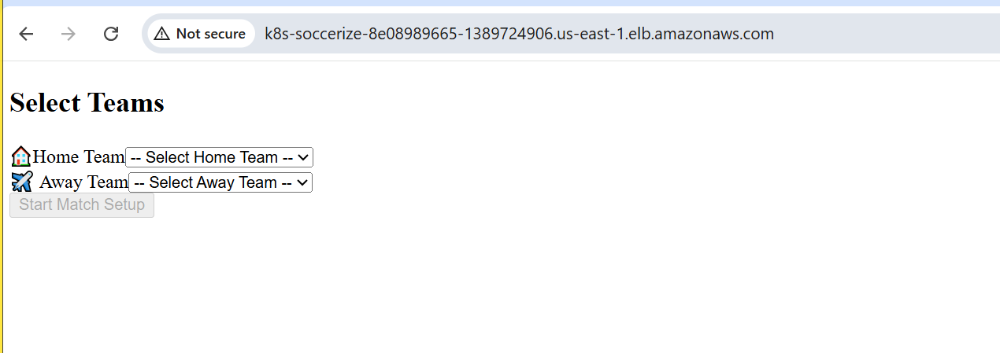
### Scoreboard View
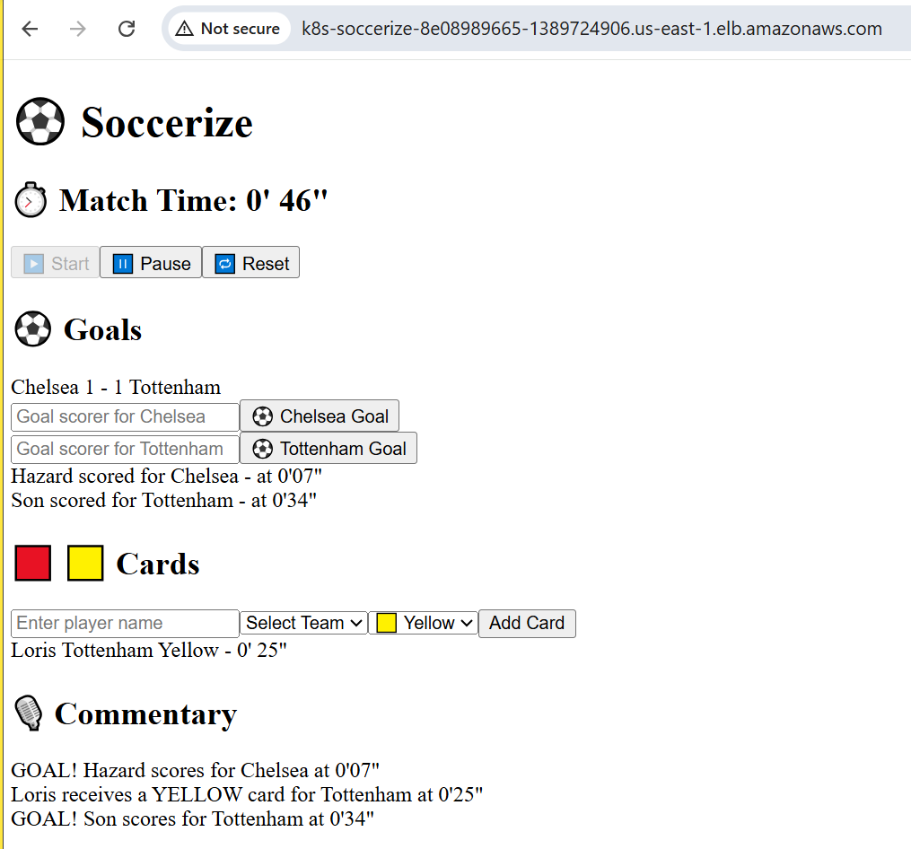


##  Table of Contents
- [About](#-about)
- [Architecture](#-architecture)
- [Tech Stack](#-tech-stack)
- [CI/CD Pipeline](#-cicd-pipeline)
- [Getting Started](#-getting-started)
- [License](#-license)


## About
Soccerize is a real-time football commentary and scoring app powered by:
-  WebSocket (AWS API Gateway)
-  AWS SQS + Lambda + DynamoDB Streams
-  CI/CD with Jenkins, GitLab, ArgoCD
-  Kubernetes (KIND/EKS)


## Architecture

###  AWS Infrastructure & Traffic Flow
This diagram illustrates how the entire AWS infrastructure is set up — including VPC, subnets, worker nodes, ALB, traffic routing, SQS, Lambda, DynamoDB, and WebSocket delivery.

[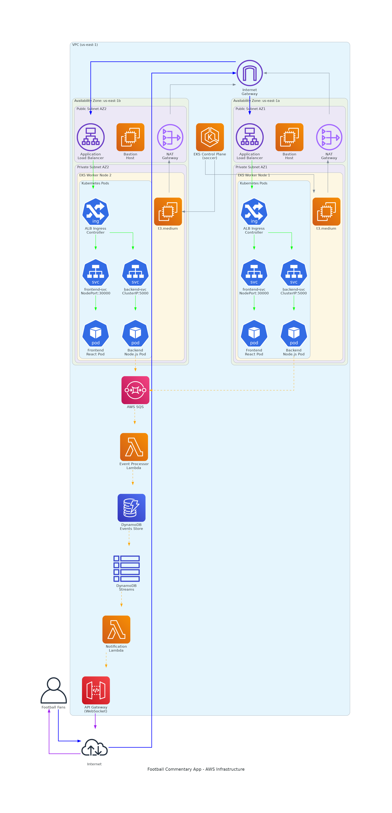](./assets/football_aws_infrastructure.png)


### Application Runtime & CI/CD Pipeline

This diagram shows how the React frontend, Node.js backend, AWS services, and the CI/CD pipeline (Jenkins + GitLab + ArgoCD) work together to deliver real-time updates.

[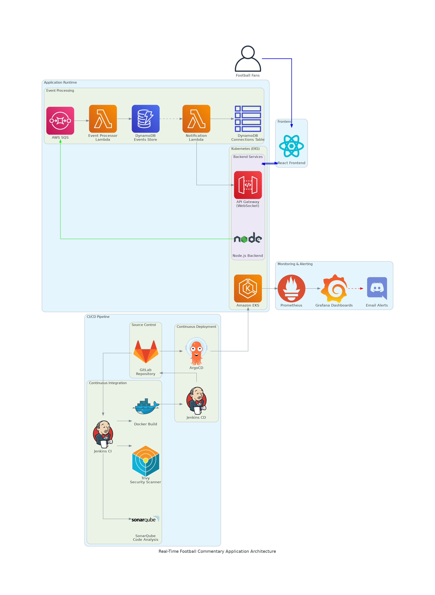](./assets/football_commentary_architecture.png)


## Tech Stack

###  Frontend
- **React.js (Vite)** – Uses React with Vite
- **WebSocket Client** – On load of frontend, auto-connects to WedSocket API for real-time commentary


###  Backend
- **Node.js + Express.js** – Handles API endpoints for goals/cards events and sends events to AWS SQS
- **AWS SDK (v3)** – Publishes messages and interacts with AWS services programmatically


### AWS Services
- **Amazon SQS** – Buffers real-time football events before processing
- **AWS Lambda** – 
  - Event Processor Lambda: Consumes SQS messages and inserts them into DynamoDB
  - Broadcaster Lambda: Triggered by DynamoDB Streams to push commentary to clients
- **Amazon DynamoDB** – Stores event data(goal/card) and active WebSocket connections
- **DynamoDB Streams** – Emits changes to trigger the Broadcaster Lambda
- **API Gateway (WebSocket)** – Pushes commentary to all connected frontend clients in real time


### Containerization
- **Docker** – Containerizes all services (frontend and backend) for consistent builds
- **Docker Compose** – *(Optional for local testing)* Spins up multi-container environments


### Kubernetes (K8s)
- **Amazon EKS** – Cluster provisioned via `eksctl` with managed node groups in private subnets
- **Ingress Controller (ALB)** – Routes external traffic to internal services securely
- **ConfigMaps & Secrets** – Injects runtime variables and credentials securely into pods


### CI/CD Pipeline
- **GitLab** – Source control with branches: `dev`, `kind-cluster`, and `eks-deploy`
- **Jenkins CI** – 
  - Pulls code on push to `eks-deploy` branch
  - Runs SonarQube for code quality and Trivy for image security (DevSecOps)
  - Builds and tags Docker images through passed parameters
  - Pushes images to Docker Hub
- **Jenkins CD** – 
  - Updates Kubernetes manifests with the new Docker image tag passed down from Jenkins CI
  - Commits and Pushes back to GitLab (GitOps)
- **ArgoCD** – Setup ArgoCD server, creates an application, watches the Git repo and syncs updated manifests  to EKS cluster


###  Monitoring & Alerts
- **Prometheus** – Collects metrics from Pods, Nodes, and Services
- **Grafana** – Visual dashboards for observability
- **Email Notification** – Sent on Jenkins job completion (success/failure)


##  CI/CD Pipeline
Fully automated workflow powered by GitLab, Jenkins, ArgoCD, and GitOps best practices. 
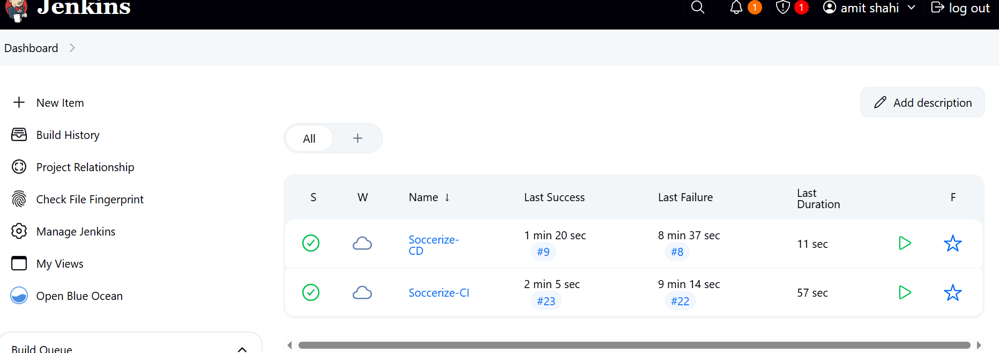

###  1. Developer Pushes Code
- Developer pushes to the `eks-deploy` branch in **GitLab**
- Passes IMAGE TAG VERSION as a parameter, GitLab triggers the **Jenkins CI** pipeline

###  2. Jenkins CI Job
- **Clones the repository**
- **Runs static code analysis** using **SonarQube**
- **Scans the project files** with **Trivy** for vulnerabilities
- **Builds Docker images** for frontend and backend
- **Tags the images** based on version 
- **Pushes images to Docker Hub**
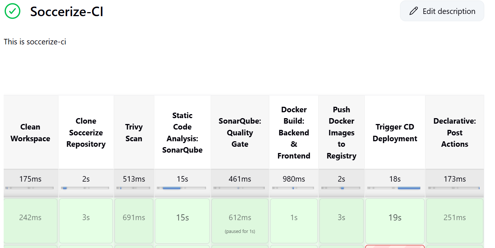

### 3. Jenkins CD Job
- Uses the new image tag as input
- **Updates Kubernetes manifests** with the new tag
- **Commits and pushes updated manifests** back to the GitLab repo
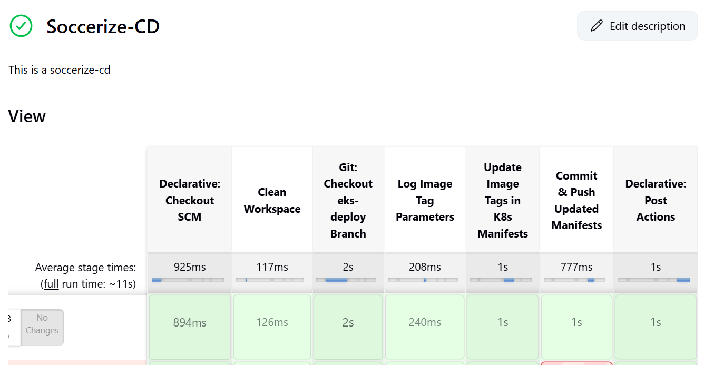

###  4. GitOps with ArgoCD
- **ArgoCD watches** the GitLab repository
- On detecting new changes:
  - Pulls updated manifests
  - Syncs them to the **EKS Kubernetes cluster**
 

###  5. Monitoring & Alerts
- **Prometheus** collects metrics from pods and nodes
- **Grafana** visualizes metrics in real-time dashboards
- **Email alerts** are sent on CI/CD success or failures 

###  DevSecOps Integrated
- Code Quality → SonarQube
- Image Vulnerability Scans → Trivy
- GitOps-Style Deployment → ArgoCD


## Getting Started
**Soccerize** is a real-time football commentary application that provisions AWS resources using **Infrastructure-as-Code (Terraform)**. 

- Remote state management (via S3 & DynamoDB) is used for core services: SQS, Lambda, DynamoDB, WebSocket API.
- Local state files are used for foundational infrastructure like VPC, Subnets, and EC2.

---
###  Step 1: Bootstrap Remote Backend
First, we need to create an S3 bucket and a DynamoDB table to **store Terraform state remotely** and **lock it during execution**.
**Location:** `~/projects/soccerize/bootstrap/main.tf`

```bash
cd ~/projects/soccerize/bootstrap
terraform init
terraform apply
```
**This provisions**
- soccerize-tf-state S3 bucket for storing .tfstate remotely
- soccerize-tf-lock DynamoDB table for state locking

###  Step 2: Provision Core AWS Services (Lambda, SQS, DynamoDB, WebSocket API)
**Location:** `~/projects/soccerize/infrastructure` (Remote state is used here)
```bash
cd ~/projects/soccerize/infrastructure
terraform init
terraform apply
```
**This provisions**
- SQS queues
- DynamoDB tables
- Lambda functions
- WebSocket API Gateway
- IAM roles and permissions

 ###  Step 3: Provision Network and Bastion Host
 **Location:** `~/projects/soccerize/scripts/provision-dev-bastion.sh` (Local state file used here)
 Instead of running Terraform manually, I use a **script to automate provisioning** and extract outputs like VPC ID, subnets, and Bastion IP.
 ```bash
cd ~/projects/soccerize/infrastructure/envs/dev
terraform init
terraform apply
```
**This script does the following:**
1. **Navigates to** `infrastructure/envs/dev/` and runs:
   - `terraform init`
   - `terraform apply -auto-approve`

2. **Provisions the following AWS resources:**
   - VPC
   - Public & Private Subnets
   - NAT Gateway
   - EC2 Bastion Host
   - Security Groups

3. **Captures important Terraform outputs automatically:**
   - `vpc_id`
   - `private_subnets` → extracts Subnet A & Subnet B
   - `bastion_public_ip`
   - `key_pair_name`

4. **Generates Kubernetes config files** using the captured outputs and environment variables:
   - `cluster-config.yml`
   - `nodegroup-config.yml`

   Generation is done using `envsubst`:
   ```bash
   envsubst < cluster-config.tpl.yml > cluster-config.yml
   envsubst < nodegroup-config.tpl.yml > nodegroup-config.yml
   ```
  - Two files gets generated under  `~/projects/soccerize/infrastructure/eks-cluster` cluster-config.yml and nodegroup-config.yml


###  Connect to the Bastion Host
Once the script finishes running, you’ll see your **VPC ID**, **Subnets**, **Bastion EC2 public IP** and **SSH key name** printed in the terminal.

To connect to the Bastion from your local machine:

```bash
ssh -i ~/projects/soccerize/key-name ubuntu@<BASTION_PUBLIC_IP>  
```

###  Step 4: Install Required Tools (Locally) on your EC2 
To interact with AWS, deploy apps, and run containers — make sure the following tools are installed on your local machine (Ubuntu/Linux).


#### Update and Install Essentials
```bash
sudo apt update && sudo apt upgrade -y
sudo apt install -y git unzip curl jq build-essential
```

####  Install Docker
```bash
sudo apt update
sudo apt install docker.io -y
sudo systemctl enable --now docker
sudo usermod -aG docker $USER && newgrp docker
```
**Verify Docker:**
```bash
docker ps
```


#### Install AWS CLI
The AWS CLI is required to authenticate and interact with AWS resources from your local terminal.
##### Install AWS CLI v2 (Linux)
```bash
curl "https://awscli.amazonaws.com/awscli-exe-linux-x86_64.zip" -o "awscliv2.zip"
unzip awscliv2.zip
sudo ./aws/install
rm -rf awscliv2.zip aws/
```
**Verify AWS**
```bash
aws --version
```

##### Configure Credentials
```bash
aws configure
```
Provide your AWS Access Key ID, AWS Secret Access Key, Default Region, and Output format.


####  Install `kubectl` (Kubernetes CLI)
`kubectl` is the command-line tool used to interact with your Kubernetes clusters.
##### Install `kubectl` (Linux)
```bash
curl -LO "https://dl.k8s.io/release/v1.33.2/bin/linux/amd64/kubectl"
chmod +x kubectl
sudo mv kubectl /usr/local/bin/
```
**Verify `kubectl`**
```bash
kubectl version
```


#### Install `eksctl` (Amazon EKS CLI)
`eksctl` is the official CLI tool for managing Amazon EKS clusters. We'll use it to create and configure our Kubernetes cluster in AWS.
##### Install `eksctl` (Linux)
```bash
curl -sL "https://github.com/eksctl-io/eksctl/releases/latest/download/eksctl_$(uname -s)_amd64.tar.gz" | tar xz -C /tmp
sudo mv /tmp/eksctl /usr/local/bin
```

**Verify `eksctl`**
```bash
eksctl version
```


### Create EKS Cluster from Bastion (via GitLab)
We'll create the EKS cluster from our **Bastion EC2 instance** using configuration files stored in a  GitLab repository.So far, we’ve generated but not pushed `cluster-config.yml` and `nodegroup-config.yml`. First, push those files to your GitLab repo before proceeding.

#### Step1: Generate SSH Key (inside Bastion EC2)
This key allows the Bastion to securely connect to GitLab and clone your repo.
```bash
ssh-keygen -t rsa -C "<your_email>" -f ~/.ssh/gitlabkey
```
**Generated files:**
- `~/.ssh/gitlabkey`       → private key
- `~/.ssh/gitlabkey.pub`   → public key

#### Step2: Add the Public Key to the Gitlab
 1. Go to **GitLab > User Settings > SSH Keys**
 2. Paste the content of `~/.ssh/gitlabkey.pub` and click **Add Key**

#### Step 3: Add the private key to SSH agent
```bash
eval $(ssh-agent -s)
ssh-add ~/.ssh/gitlabkey
```
#### Step 4: Clone your repo from GitLab
```bash
mkdir -p ~/projects
cd ~/projects
git clone -b eks-deploy git@gitlab.com:<your-username>/<your-repo>.git
cd soccerize
git branch
#you should see eks-deploy
```

**Files to look for:**
- eks-cluster/
 ├── cluster-config.yml
 └── nodegroup-config.yml


#### Create the EKS Cluster
```bash 
cd eks-cluster
eksctl create cluster -f cluster-config.yml
```

**Verify Cluster**
```bash
kubectl version
```
**If you see this error:**
 Unable to connect to the server: dial tcp ... i/o timeout
**It means the Bastion cannot reach the EKS control plane (port 443 is blocked).**


**Fix Security Group Ingress from Bastion to EKS Cluster SG**
```bash
aws ec2 authorize-security-group-ingress \
  --group-id <CLUSTER-SG-ID> \
  --protocol tcp \
  --port 443 \
  --source-group <BASTION-SG-ID> \
  --region <DEFAULT-REGION>
```  

**Verify again**
```bash
kubectl version
```
**Expected:**
 Client Version: v1.33.2
 Server Version: v1.30.x-eks-xxxxx
 You're now fully connected to the EKS cluster from Bastion 

#### Step 5: Update kubeconfig (So kubectl can talk to the cluster)
After the cluster is created, run the following command from the Bastion EC2 instance:
```bash
aws eks update-kubeconfig --name <CLUSTER-NAME> --region <DEFAULT-REGION>
```
**This command:**
- Retrieve the cluster details from AWS
- Add or update the kubeconfig file at ~/.kube/config
- Allow kubectl to authenticate with the EKS API


#### Step 6: Verify Kubernetes Default Services
Run the following to list all services running in the default namespace:
```bash
kubectl get svc
```
- Returns the default Kubernetes Service of TYPE CLUSTER IP- the virtual IP of the Kubernetes Service.


### Create NodeGroup from Bastion
- Provisions worker nodes based on your nodegroup-config.yml
```bash
eksctl create nodegroup -f nodegroup-config.yml
```

**Verify Nodes**
```bash
kubectl get nodes
```
- Provisions two worker nodesacross two  AZ's inside  private subnets.


### Install AWS  Load Balancer Controller
#### Step1: Associate Your AWS Account With OIDC Provider
```bash
eksctl utils associate-iam-oidc-provider --region <DEFAULT-REGION> --cluster <CLUSTER-NAME>> --approve
```


#### Step2: Download the AWS ALB IAM Policy
```bash
curl -o iam_policy.json https://raw.githubusercontent.com/kubernetes-sigs/aws-load-balancer-controller/main/docs/install/iam_policy.json
```

#### Step3: Create IAM Policy
```bash
aws iam create-policy \
  --policy-name AWSLoadBalancerControllerIAMPolicy \
  --policy-document file://iam_policy.json
```

#### Step4: Create IAM Service Account for ALB Controller
```bash
eksctl create iamserviceaccount \
  --cluster=soccer \
  --region=us-east-1 \
  --namespace=kube-system \
  --name=aws-load-balancer-controller \
  --attach-policy-arn=arn:aws:iam::211125312142:policy/AWSLoadBalancerControllerIAMPolicy \
  --approve
```


#### Step5: Install Helm
```bash
curl https://raw.githubusercontent.com/helm/helm/master/scripts/get-helm-3 | bash
```


#### Step6:  Add EKS Helm Chart Repo
```bash
helm repo add eks https://aws.github.io/eks-charts
helm repo update
```


#### Step7:  Install the AWS Load Balancer Controller via Helm
```bash 
helm upgrade -i aws-load-balancer-controller eks/aws-load-balancer-controller \
  -n kube-system \
  --set clusterName=<CLUSTER-NAME>> \
  --set serviceAccount.create=false \
  --set serviceAccount.name=aws-load-balancer-controller \
  --set region=<DEFAULT-REGION>> \
  --set vpcId=<VPC ID> \    
  --set image.tag="v2.7.1"
```

**Verify Deployment**
```bash
kubectl get deployment -n kube-system aws-load-balancer-controller
```

### Deploy All Kubernetes Resources (Frontend + Backend + Ingress)
```bash
kubectl apply -f namespace/
kubectl apply -f configmaps/
kubectl apply -f secrets/
kubectl apply -f deployments/
kubectl apply -f service/
kubectl apply -f ingress-resource/
```
**Important- Update Public Subnets in ingress-resource/ YAMLs**
**For frontend-ingress.yaml and backend-ingress.yaml, update the annotation:**
```bash
annotations:
  alb.ingress.kubernetes.io/subnets: <PUBLIC-SUBNET1>,<PUBLIC-SUBNET2>
  alb.ingress.kubernetes.io/target-type: ip
  #These are the public subnet IDs from your VPC, generated during the bastion + network provisioning phase (infrastructure/envs/dev)
  #Copy those values and paste into both Ingress YAMLs.
```  

**Verify ALB Ingress**
```bash
kubectl get ingress -n soccerize-app
```
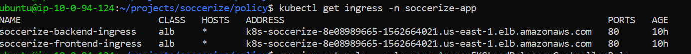


 

---
### Install Docker
```bash
sudo apt update
sudo apt install -y docker.io
sudo systemctl start docker
sudo systemctl enable docker
```


### Install Jenkins
#### Update & Install Java (JRE)
```bash
sudo apt install -y openjdk-17-jre
```

#### Add Jenkins Repo and Install
```bash
curl -fsSL https://pkg.jenkins.io/debian-stable/jenkins.io-2023.key | sudo tee \
  /usr/share/keyrings/jenkins-keyring.asc > /dev/null

echo deb [signed-by=/usr/share/keyrings/jenkins-keyring.asc] \
  https://pkg.jenkins.io/debian-stable binary/ | sudo tee \
  /etc/apt/sources.list.d/jenkins.list > /dev/null


sudo apt update
sudo apt install jenkins -y

#Start and Enable Jenkins
sudo systemctl start jenkins
sudo systemctl enable jenkins


#Check Status
sudo systemctl status jenkins


#Access Jenkins
 http://<EC2-PUBLIC-IP>:8080
#Retrive the Jenkins Password
sudo cat /var/lib/jenkins/secrets/initialAdminPassword
```

### Install Trivy
#### Install Required Packages
```bash
sudo apt update
sudo apt install -y wget apt-transport-https gnupg lsb-release
```


#### Add Trivy APT Repo and GPG Key
```bash
wget -qO - https://aquasecurity.github.io/trivy-repo/deb/public.key | \
  sudo gpg --dearmor -o /usr/share/keyrings/trivy.gpg

echo "deb [signed-by=/usr/share/keyrings/trivy.gpg] \
  https://aquasecurity.github.io/trivy-repo/deb \
  $(lsb_release -cs) main" | \
  sudo tee /etc/apt/sources.list.d/trivy.list > /dev/null
```


#### Install Trivy
```bash
sudo apt update
sudo apt install -y trivy
```
**Verify Installation**
```bash
trivy --version
```


### Run SonarQube  in Docker
```bash
docker run -itd \
  --name sonarqube \
  -p 9000:9000 \
  -e SONAR_ES_BOOTSTRAP_CHECKS_DISABLE=true \
  -v sonarqube_data:/opt/sonarqube/data \
  -v sonarqube_extensions:/opt/sonarqube/extensions \
  sonarqube:lts-community
 ``` 

**Verify SonarQube**
```bash
docker ps
```


#### Access SonarQube Web UI
```bash
http://<EC2-PUBLIC-IP>:9000
#Default login Username admin Password admin
```


### Install OWASP & DevSecOps Plugins on Jenkins
1. Go to **Jenkins Dashboard → Manage Jenkins → Plugin Manager → Available Plugins**
2. Use the search bar and install these plugins:
- OWASP Dependency-Check Plugin  
- SonarQube Scanner  
- Docker Pipeline  
- Pipeline: Stage View  
- Blue Ocean 


### Integrate Jenkins with SonarQube (DevSecOps Style)
This section explains how to securely integrate Jenkins with SonarQube for static code analysis as part of your CI/CD pipeline.

---

#### Step 1: Generate SonarQube Token (From SonarQube UI)

1. Login to your SonarQube instance:  
   `http://<EC2-IP>:9000`

2. Navigate to:  
   **Administration → Security → Users → Tokens**

3. Click **Generate Token**

   - **Name:** `jenkins-token` (or any name of your choice)

4. Copy the token and save it temporarily.  
   *You won’t be able to see it again later.*

---

#### Step 2: Add Token to Jenkins as a Secret

1. Open Jenkins and go to:  
   **Manage Jenkins → Credentials → (Global) → Add Credentials**

2. Fill in the following:

   - **Kind:** `Secret text`  
   - **Secret:** `<paste the token copied from SonarQube>`  
   - **ID:** `sonar`  
   - **Description:** `SonarQube Access Token`

---

#### Step 3: Install SonarQube Scanner in Jenkins

1. Navigate to:  
   **Manage Jenkins → Global Tool Configuration**
2. Scroll down to **SonarQube Scanner** section.
3. Configure the tool:
   - **Name:** `SonarScanner`  
   - Check **Install automatically**

---


#### Step 4: Add SonarQube Server to Jenkins

1. Go to:  
   **Manage Jenkins → Configure System**

2. Find the **SonarQube servers** section.

3. Add the following:

   - **Name:** `SonarQube`  
   - **Server URL:** `http://<EC2-IP>:9000`  
   - **Server authentication token:** Select the `sonar` credential added earlier 

---

#### Step 5: Register Jenkins Webhook in SonarQube

1. Visit SonarQube Webhooks:  
   `http://<EC2-IP>:9000/admin/webhooks`

2. Click **Create** and fill in:

   - **Name:** `jenkins-webhook`  
   - **URL:** `http://<JENKINS-EC2-IP>:8080/sonarqube-webhook/`

3. Click **Save**

>  The webhook ensures that SonarQube sends analysis results back to Jenkins after scanning is complete.

---


### Integrate Jenkins with GitLab

This section explains how to integrate GitLab with Jenkins 

---


#### Step 1: Create Personal Access Token in GitLab

1. Login to your GitLab account.
2. Navigate to:  
   **User Settings → Access Tokens**
3. Fill in the token details:
   - **Name:** `gitlab-token`  
   - **Scopes:**  `read_repository`,  `write_repository`,  `api`
4. Click **Create Personal Access Token**.
5. **Copy and store the token securely.**  
   *You won’t be able to see it again once you leave the page.*

---

#### Step 2: Add GitLab Token to Jenkins

1. Open Jenkins and go to:  
   **Manage Jenkins → Credentials → (Global) → Add Credentials**
2. Select:
   - **Kind:** `Username with password`
   - **Username:** `<your-gitlab-username>`
   - **Password:** `<paste the GitLab personal access token>`
3. Provide:
   - **ID:** `GitlabCred`  
   - **Description:** `GitLab PAT for Jenkins Integration`
4. Click **OK** to save.

---


#### Step 3: Connect GitLab with Jenkins
Follow the steps below to integrate GitLab with Jenkins:
---
##### Step 3.1 : Install GitLab Plugin
1. Navigate to **Jenkins** → **Manage Jenkins** → **Plugins**.
2. Under the **Available** tab, search for: `GitLab Plugin`.
3. Select and install the plugin.
4. Restart Jenkins if prompted.
---
#####  Step 3.2: Configure GitLab Connection
1. Go to **Jenkins** → **Manage Jenkins** → **Configure System**.
2. Scroll down and find the **GitLab** section.
3. Fill in the connection details:

   - **Connection Name:** `gitlab`  
   - **GitLab Host URL:** `https://gitlab.com`  
   - **Credentials:**  
     - Click **Add** and enter your GitLab **Personal Access Token (PAT)**.
     - Select the created credential from the dropdown.
4. Click **Test Connection** to verify the setup.
5. Finally, click **Save**.
---
Your Jenkins instance is now connected to GitLab and ready for GitOps or CI/CD integrations.


---


### Install and Configure Argo CD on EC2 (Master Machine)

This guide walks you through:

- Installing Argo CD on your EKS cluster  
- Accessing Argo CD UI securely via browser  
- Connecting your GitLab repository for GitOps workflows  

---

#### Step1: Full Setup Instructions
```bash
# Step 1: Create Argo CD Namespace
kubectl create namespace argocd
```

#### Step 2: Install Argo CD Components
```bash
kubectl apply -n argocd -f https://raw.githubusercontent.com/argoproj/argo-cd/stable/manifests/install.yaml
```

#### Step 3: Watch Argo CD Pods Come Up
```bash
watch kubectl get pods -n argocd
```

#### Step 4: Install Argo CD CLI on EC2
```bash
sudo curl --silent --location -o /usr/local/bin/argocd \
  https://github.com/argoproj/argo-cd/releases/download/v2.4.7/argocd-linux-amd64
sudo chmod +x /usr/local/bin/argocd
```

#### Step 5: Check Argo CD Services
```bash
kubectl get svc -n argocd
```

#### Step 6: Port Forward Argo CD Server on EC2 (to avoid Jenkins 8080)
```bash
kubectl port-forward svc/argocd-server -n argocd 8081:443
```

#### Step 7: SSH Port Forward from Your Local Machine
Run this command on your local machine to forward Argo CD to your browser:
```bash
ssh -i terra-key -L 8080:localhost:8081 ubuntu@<EC2-PUBLIC-IP>
Then open your browser and go to:
`http://localhost:8080`
```
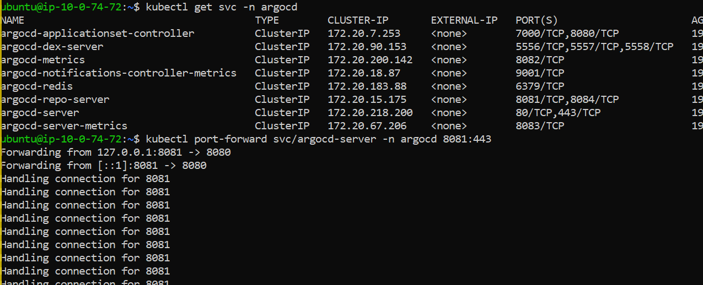

#### Step 8: Log In to Argo CD
Default credentials:
- **Username:** `admin`  
- **Password:** Run this command to retrieve it:
```bash
kubectl -n argocd get secret argocd-initial-admin-secret \
  -o jsonpath="{.data.password}" | base64 -d && echo
```
- Use the output password to log in to the Argo CD UI.


#### Step 9: Reset the Admin Password
After logging in to the Argo CD UI:
1. Click the user icon in the top-right corner.  
2. Select **Change Password**.  
3. Enter your **Current Password**.  
4. Enter your **New Password**.  
5. Confirm the **New Password**.  
6. Re-login using your new password.

#### Step 10: Connect Your GitLab Repository to Argo CD
Inside the Argo CD UI:
1. Navigate to **Settings → Repositories → Connect Repo**.  
2. Fill out the form with the following details:

- **Type:** Git  
- **Project:** default  
- **Connection:** HTTPS  
- **Repository URL:** `<your-gitlab-repo>`  
- **Username:** `<your-gitlab-username>`  
- **Password (GitLab personal access token):** `<your-gitlab-PAT>`  
3. Click **Connect** 


### Deploy Application to Argo CD
This guide walks you through creating an **Argo CD Application** that connects to your GitLab repository and deploys resources from a specific path and branch.
---
#### Prerequisite: Argo CD Cluster Connected
Check connected clusters using:
```bash
argocd cluster list
```
 SERVER                         NAME        STATUS      MESSAGE
https://kubernetes.default.svc in-cluster  Successful  cluster has no application and is not monitored


#### Step 1: Create a New Argo CD Application
To get started with deploying your Kubernetes resources using Argo CD, you need to create a new application.
Follow these steps:
1. Open your browser and go to the Argo CD UI  
   > Usually accessible via: `http://localhost:8080` 
   (Ensure you have an SSH port-forward session running)
2. On the Argo CD dashboard, click on the **`+ NEW APP`** button in the top menu.
3. Proceed to configure the application with the necessary Git repository, destination cluster, sync policy, and other details.


#### Application Configuration
After clicking **NEW APP** in the Argo CD UI, fill out the form with the following details:

- **Application Name:** `soccerize-app`
- **Project Name:** `default`
- **Sync Policy:** Select `Automatic`

 Enable the following options by checking the checkboxes:

- ` PRUNE RESOURCES`
- ` SELF HEAL`
- ` AUTO-CREATE NAMESPACE`


#### Git Repository
Provide the following Git details in the application configuration form:

- **Repository URL:** `<your-gitlab-repo>`
- **Revision (Branch):** `<your-brachname>`
- **Path:** `k8s/dev<place-where-manifests-live>`


#### Destination Cluster Configuration
In the **New Application** setup screen of Argo CD, under the **Destination** section, configure the following:

- **Cluster URL:** `https://kubernetes.default.svc`
- **Namespace:** `<your-namespace-of-soccerizeapp>`

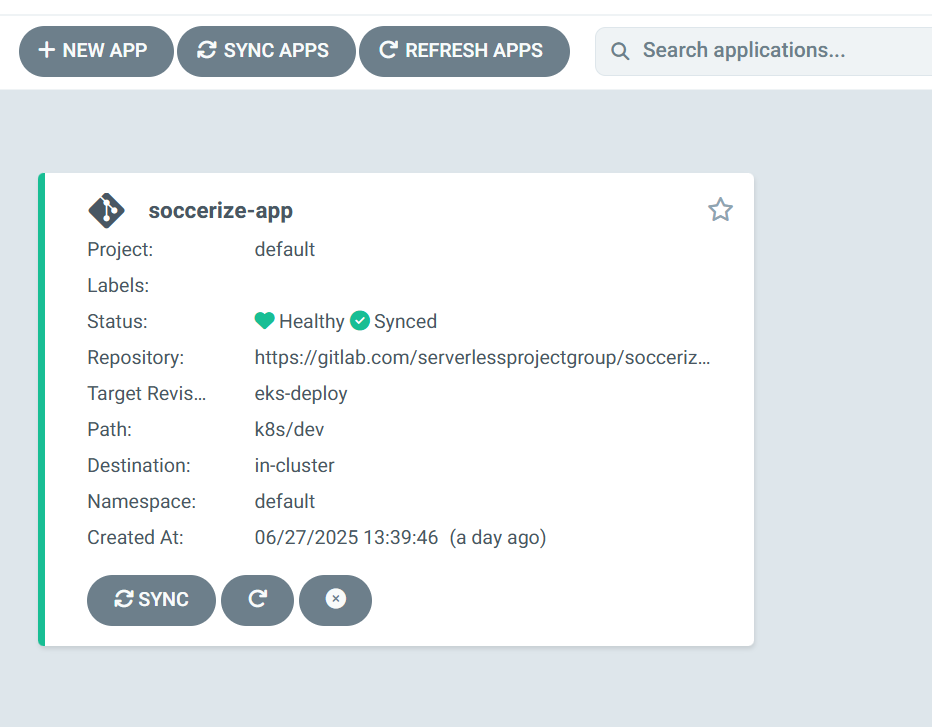


### Jenkins Shared Library Setup
Follow these steps to configure the Shared Library in Jenkins for your pipeline:

1. Go to **Manage Jenkins** → **System**.
2. Search for **Global Trusted Pipeline Libraries**.
3. Add a new library with the following details:
   - **Name:** `Shared`
   - **Default Version:** `eks-deploy<your-gitlab-repo-branch-name>`
   - **Project Repository:** `<jenkins-shared-lib><which-we-will-create-in-next-step>`
   - **Credentials:** Select your GitLab credentials (`<your-gitlab-credential>`)
4. Save the configuration.
Your Jenkins pipeline can now use this shared library for deployments.


#### Jenkins Shared Library Setup and Usage Guide
This guide explains how to create and use a **Jenkins Shared Library** repository hosted on GitLab for reusable pipeline code.
---


#### 1. Create the GitLab Repository
- Create a new repository in GitLab named `jenkins-shared-lib`.
- Initialize it with a README (optional).

---


#### 2. Clone the Repository Locally

Open your terminal and run locally:

```bash
cd ~/projects
git clone <gitlab-repo-url-for-jenkins-shared-lib>
cd jenkins-shared-lib
```


#### 3. Setup Directory Structure, Commit and Push to eks-deploy branch
```bash
git checkout -b eks-deploy
mkdir vars
cd vars
git add vars/*.groovy
git commit -m "Add reusable pipeline scripts for eks-deploy"
git push origin eks-deploy
```


#### 4. Usage in Pipeline
At the top of your Jenkins pipeline script, include the shared library by adding:
```bash
@Library('Shared') _
# code
steps #{
      #  build() # Calls build.groovy in vars/
      #}
```


### Docker Hub Token Setup in Jenkins
To enable Jenkins to authenticate with Docker Hub, add your Docker Hub credentials as follows:
---

#### Steps to Add Docker Hub Credentials
1. Navigate to **Manage Jenkins** → **Credentials**.
2. Add new credentials with the following details:
   - **Kind:** Username with password
   - **Username:** `<your-dockerhub-username>`
   - **Password:** `<your-dockerhub-PAT>`  
   - **ID:** `docker`
   - **Description:** `dockerhub creds`
3. Save the credentials.
---
You can now reference these credentials in your Jenkins pipelines using the ID `docker`.


### Jenkins CI/CD Pipeline Setup for Soccerize
This guide explains how to set up two Jenkins pipelines:
-  **Soccerize-CI** – Continuous Integration
-  **Soccerize-CD** – Continuous Deployment
---


#### Soccerize-CI Pipeline Setup
##### Create New Item
1. Go to Jenkins → **New Item**
2. Name: `Soccerize-CI`
3. Type: **Pipeline**
4. Click OK
##### Configuration
- **Description:** `This is a soccerize-ci pipeline`
- Tick: `Discard old builds`
  - Days to keep builds: `1`
  - Max builds to keep: `2`


##### This Project is Parameterized

- Check: `This project is parameterized`
-  Add the following **String Parameters**:
  - `FRONTEND_DOCKER_TAG`
  - `BACKEND_DOCKER_TAG`


##### GitLab Configuration
- **GitLab Connection:** Select `gitlab` from the dropdown (must be configured in Jenkins system config)


##### Source Control
- **Definition:** `Pipeline script from SCM`
  - SCM: `Git`
  - **Repository URL:** `<your GitLab repository URL>`
  - **Credentials:** `<your GitLab PAT credential>`
  - **Branch Specifier:** `*/eks-deploy`
  - **Script Path:** `Jenkinsfile`
##### Build Trigger (Optional)
-  Check: `Trigger builds remotely`
  - Authentication Token: `soccerize-ci-token`

---

#### Soccerize-CD Pipeline Setup

##### Create New Item
1. Go to Jenkins → **New Item**
2. Name: `Soccerize-CD`
3. Type: **Pipeline**
4. Click OK
##### Configuration
- **Description:** `This is a soccerize-cd pipeline`
- Tick: `Discard old builds`
  - Days to keep builds: `1`
  - Max builds to keep: `2`

##### GitLab Configuration
- **GitLab Connection:** Select `gitlab` from the dropdown


##### Source Control
- **Definition:** `Pipeline script from SCM`
  - SCM: `Git`
  - **Repository URL:** `<your GitLab repository URL>`
  - **Credentials:** `<your GitLab PAT credential>`
  - **Branch Specifier:** `*/eks-deploy`
  - **Script Path:** `GitOps/Jenkinsfile`


##### Build Trigger (Optional)
- Check: `Trigger builds remotely`
  - Authentication Token: `soccerize-ci-token`

---

## Summary

- `Soccerize-CI` points to the root-level `Jenkinsfile`
- `Soccerize-CD` points to `Gitops/Jenkinsfile`
- Both pipelines are configured to discard old builds and can be triggered remotely

Now just write the corresponding pipeline code in each `Jenkinsfile`, and you're good to go!


### Kubernetes Monitoring with Prometheus & Grafana using Helm
#### Step 1: Install Helm
```bash
curl https://raw.githubusercontent.com/helm/helm/main/scripts/get-helm-3 | bash
```

#### Add Prometheus Community Helm Repo
```bash
helm repo add prometheus-community https://prometheus-community.github.io/helm-charts
helm repo update
```

#### Create monitoring Namespace
```bash
kubectl create namespace monitoring
```

#### Install Prometheus + Grafana Stack
```bash
helm install prometheus prometheus-community/kube-prometheus-stack \
  --namespace monitoring
```
  
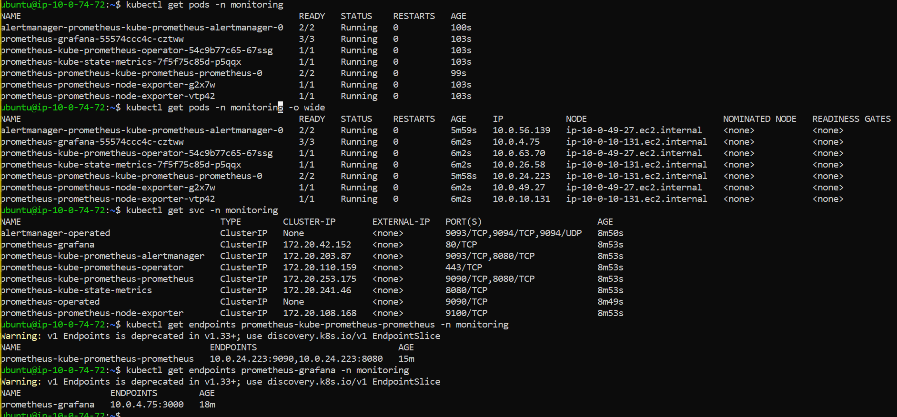  

#### Accessing the Dashboards
##### Grafana UI (Port 3000)
```bash
kubectl port-forward svc/prometheus-grafana 3000:80 -n monitoring
```
**Now visit: http://localhost:3000 from your local server**
**Default Grafana Credentials:**
- Username: admin
- Password: prom-operator


##### Prometheus UI (Port 9090)
```bash
kubectl port-forward svc/prometheus-kube-prometheus-prometheus 9090:9090 -n monitoring
```
**Now visit: http://localhost:9090 from your local server**

##### Remote Access from Local Machine (EC2 SSH Tunnel)
```bash
ssh -i terra-key \
  -L 3000:localhost:3000 \
  -L 9090:localhost:9090 \
  ubuntu@<EC2-PUBLIC-IP>
```


### Frontend Metrics

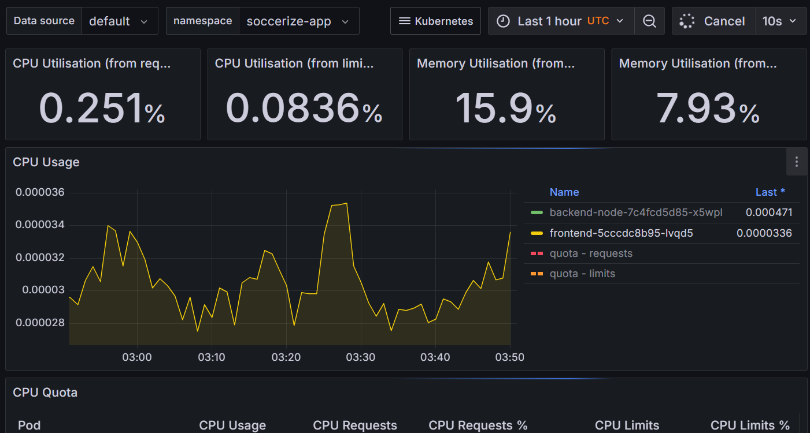

### Backend Metrics

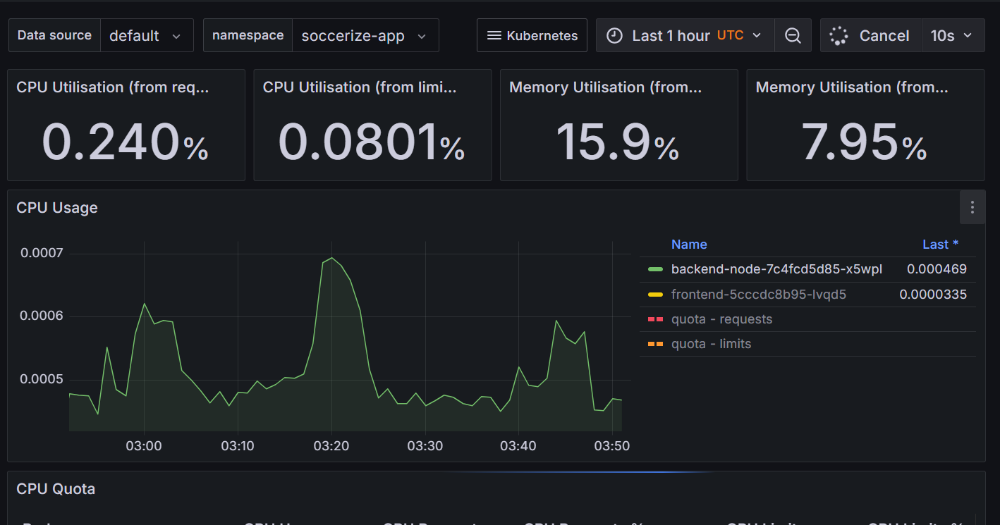


## License

This project is licensed under the **MIT License**.  
Feel free to use, modify, and distribute this software with proper attribution.  
See the [LICENSE](./LICENSE) file for full license details.
