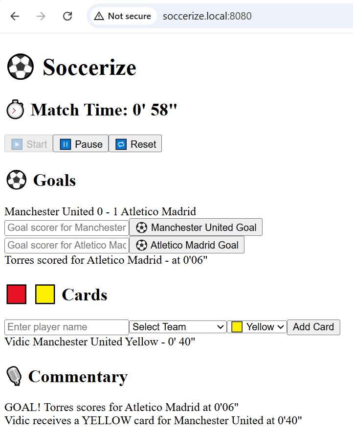

# Soccerize Football App
Soccerize Football is fullstack, event driven real time football simulation app supporting real-time  goals, cards (yellow or red), and commentary powered by AWS services- Simple Queue Service(SQS), Lambda, DynamoDB, DynamoDB Stream, WebSocket APIs, along with Express Server and React with Vite.

#
Soccerize Football 
#

 ### In this demo, we will see how to deploy an end to end three tier soccerize application on KIND cluster.

### Architecture
Frontend (React + WebSocket) <---> Backend Node API <---> AWS SQS Queue
                                                   ↓
                                                Lambda (Commentary)
                                                   ↓
                                            DynamoDB + DynamoDB Streams
                                                   ↓
                                     Lambda (Broadcaster) --> WebSocket Clients


### Folder Structure
| Folders        |    Description |
| frontend/      |    React app using Vite. Live UI action for goals ,cards and commentary |
| backend-node/  |    Express API server handling  goals, cards, and reset logic |
| lambda-functions/ | Lambda function encapsulates all the business logic |
| infrastructure/  |  Terraform code provisioning all AWS resources |
| bootstrap/       |  Terraform backend and remote state setup    |
| dev-env-setup.sh |  Set the infrastructure up and extract the env variables |


### Setup Instruction
### Prerequites-
   -AWS CLI Configured
   -Terraform Installed
   -Node.js

### Getting Started
  Run the script dev-env-setup.sh
  It will provision all the necessary AWS resources needed for the app, extracts env variables
  from the main Terraform's output file and inject into frontend and backend services.

### Tools Used:
    React 19.0 (with TailwindCSS, Shadcn/ui, Vite and Typescript)
    Express.js
    SQS, Lambda, DynamoDB, DynamoDB Stream, WebSocket APIs
    Terraform (modularized)

### Frontend:
    Allows you to pick teams (home team and away team) 
    Displays clock (you can start, pause and reset the match)   
    Simulate goal, card action while match is going on
    Commentary of your goal or card action is auto updated
     
### Frontend usgae:
     cd frontend
     npm install
     npm run dev
.env setup for Frontend
     VITE_SOCKET_URL=wss://<your-websocket-id>.execute-api.<region>.amazonaws.com/dev
     VITE_API_BASE_URL=http://localhost:5000

### Backend-node
     Receives the POSTs for /goal , /card, /reset
     Send the goal or card event to SQS 
     Act as a bridge between Frontend and AWS
### Backend usgae:
     cd backend-node
     npm install
     node index.js    

.env setup for Backend
     PORT=5000
     SQS_QUEUE_URL=https://sqs.<region>.amazonaws.com/<account-id>/soccerize-commentary-queue
     TABLE_NAME=SoccerizeCommentary

### infrastructure (Modularized)
     Provisions all necessary AWS Services
     SQS (main queue ,DLQ)
     Lambda Functions
     DynamoDBs with Stream emabled
     Websocket APIs (with connect, disconnect routes)    

### Usage
    cd infrastructure
    terraform init
    terraform apply -auto-approve

### Lambda Functions
    commentary-> gets triggered by SQS, and writes events (goal, card) to DynamoDB
    websockets/broadcast->get triggered by DynamoDB stream, get new INSERTED record (commentary)
                        and broadcast to those clients which are connected by connectionId
    websocket/connect-> Adds connectionId to DynamoDB, to track connected clients     
    websockets/disconnect-> Deleted connectionId from DynamoDB 

### Usage: Deployment of lambda Functions
    cd lambda-functions/commentary
    npm install
    zip -r lambda.zip index.js
    #Repeat the same process for broadcast, connect and disconnect
    #AWS Handles the rest- uploading the zipped code to AWS Lambda

### Logs:
   All logs are logged in CloudWatch for debugging     

### Install KIND and Kubectl
 ./install_kind.sh

### Create Cluster
 ./k8s/kind_cluster.yml

#
# Verify Nodes
```bash
kubectl get nodes -o wide
```

#
# Label Nodes
```bash
kubectl label node soccerize-cicd-cluster-worker frontend-node=true
kubectl label node soccerize-cicd-cluster-worker2 backend-node=true
```

#
# Taint backend-node
```bash
kubectl taint nodes soccerize-cicd-cluster-worker2 backend-only=true:NoSchedule
```

#
- Verify
```bash
kubectl get nodes --show-labels
```

# Create Namespace
```bash
kubectl create namespace soccerize-app
```

# Install Ingress-NGINX for KIND
```bash
kubectl apply -f https://raw.githubusercontent.com/kubernetes/ingress-nginx/controller-v1.11.1/deploy/static/provider/kind/deploy.yaml
```

# Label Ingress-NGINX-Controller Pod so that pod can land on one of the worker nodes
```bash
kubectl label node soccerize-cicd-cluster-worker ingress-ready=true
```

# Verify that ingress-nginx-controller pod is running or not
```bash
kubectl get nodes -n ingress-nginx
```

# Verify ingress-nginx service
```bash
kubectl get svc -n ingress-nginx
```

### Build, Tag and Push images to dockerhub
 ./scripts/docker-compose-build-push.sh

# Apply Kubernetes Manifests
```bash
kubectl apply -f ./k8s/dev/secrets/. -n soccerize-app
kubectl apply -f ./k8s/dev/configmaps/. -n soccerize-app
kubectl apply -f ./k8s/dev/deployments/. -n soccerize-app
kubectl apply -f ./k8s/dev/ingress-resource/. -n soccerize-app
kubectl apply -f ./k8s/dev/service/. -n soccerize-app
```

# Map soccerize.local to localhost
```bash
sudo echo "127.0.0.1 soccerize.local" >> /etc/hosts
```


# Run the Soccerize-app
```bash
kubectl port-forward svc/ingress-nginx-controller -n ingress-nginx 8080:80
```




       
     


